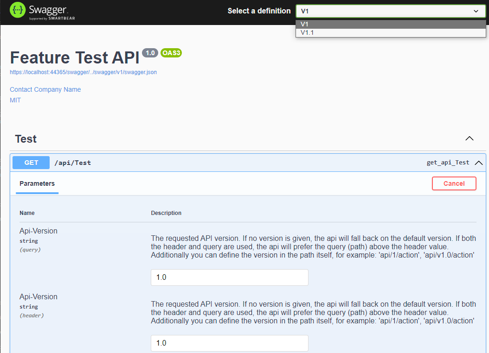

# NOW.ApiVersioning.Swagger

This package contains extensions to add a 'Versioned Swagger' and 'Versioned Swagger UI' documentation, using the 
`NOW.ApiVersioning` package.



```csharp
// Configure versioned SwaggerGen options.
if (apiVersioningOptions != null)
{
    builder.Services.ConfigureApiVersioningSwaggerGenOptions();
}

// Learn more about configuring Swagger/OpenAPI at https://aka.ms/aspnetcore/swashbuckle
builder.Services.AddSwaggerGen(options =>
{
    ...

    // Configures swagger for support with versioning via the path, query or header.
    if (apiVersioningOptions != null)
    {
        options.SetDefaultApiVersioningOptions();
    }

    ...
});
```

In the example:
- The extensions (from `NOW.ApiVersioning.Swagger.Extensions`) are used to
  - Add the out-of-the-box [`SwaggerGenOptions`](https://docs.microsoft.com/en-us/aspnet/core/tutorials/getting-started-with-swashbuckle?view=aspnetcore-6.0&tabs=visual-studio#customize-and-extend).
    The values will be taken from the `NOW.ApiVersioning` configuration
    (`appsettings.json\ApiVersioning\ApiDescription` section).<br>
    _Note that the `apiVersioningOptions` have to be available in via Dependency Injection, or have to be provided via the optional argument._
  - In the out-of-the-box `AddSwaggerGen` options configuration, swagger is configured to support the routing from the `ApiVersioning`
    extensions.

```csharp
/*
    Start of the HTTP request pipeline configuration.
*/
var app = builder.Build();

if (app.Environment.IsDevelopment())
{
    if (apiVersioningOptions != null)
    {
        // Add versioned Swagger docs using the ApiVersioning package.
        app.UseVersionedSwagger();
        app.UseVersionedSwaggerUI();
    }
    else
    {
        // Add default Swagger docs.
        app.UseSwagger();
        app.UseSwaggerUI();
    }

    app.UseDeveloperExceptionPage();
}

// Configure middleware.
app.UseMiddleware<ApiVersionMiddleware>();
```

In the example:
- `app.UseVersionedSwagger()` sets the routing template, when no route is supplied the route `swagger/{documentName}/swagger.json` will be used;
- `app.UseVersionedSwaggerUI()` configures the SwaggerUI and adds an endpoint per API Version. When no route is supplied the route `swagger/{documentName}/swagger.json` will be used..
